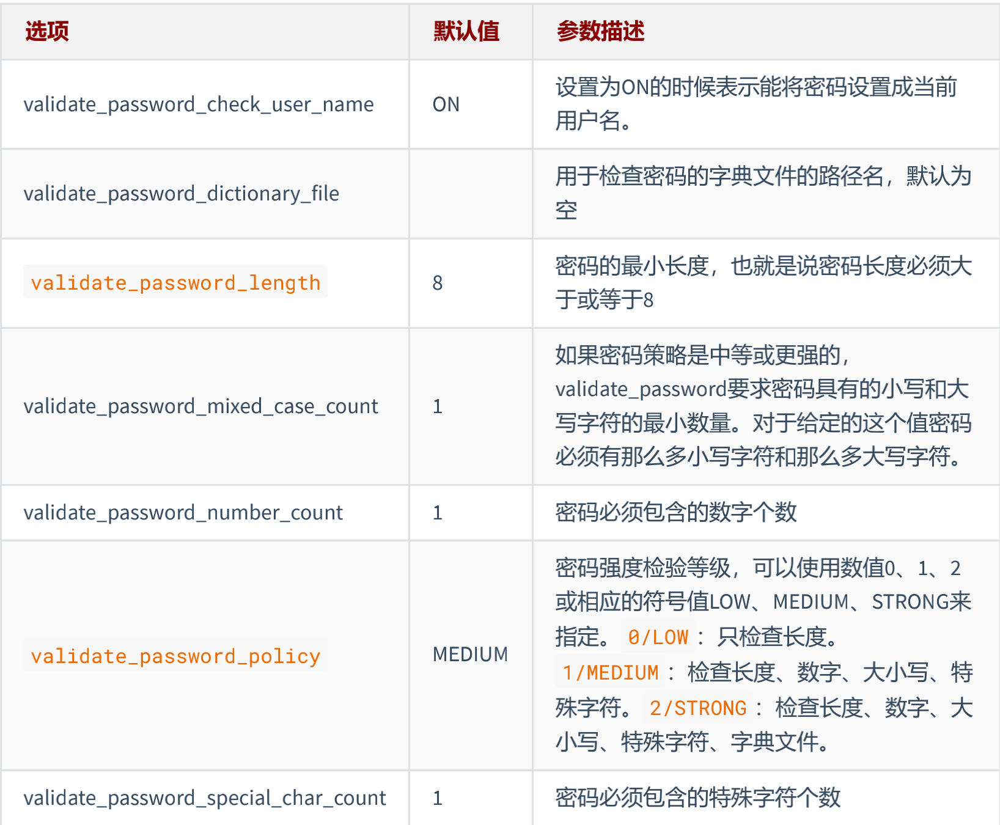

#### **安装启动**
#### **远程登录**
#### **密码强度**

```
show variables like 'validate_password%';
SET GLOBAL validate_password_policy=LOW;
```
#### **字符集**
#### **大小写规范**
#### **sql_mode的合理设置**
```
查看
select @@session.sql_mode 
select @@global.sql_mode 
或者 show variables like 'sql_mode';
设置
set SESSION sql_mode='STRICT_TRANS_TABLES'; 
set GLOBAL sql_mode='STRICT_TRANS_TABLES';
永久设置方式：在/etc/my.cnf中配置sql_mode
```
