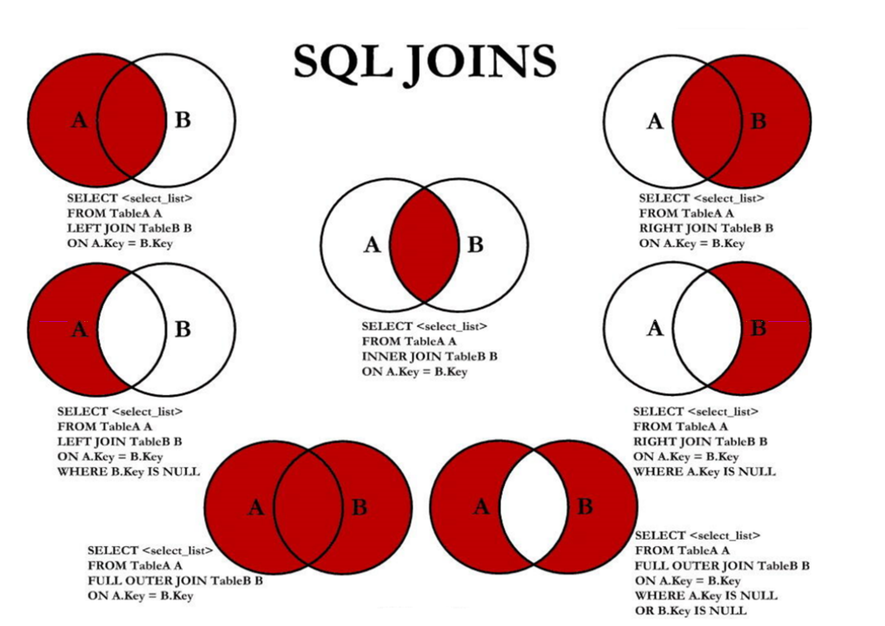

#### **笛卡尔积（或交叉连接 CROSS JOIN）**
```
SELECT table1.column, table2.column
FROM table1, table2
WHERE table1.column1 = table2.column2; #连接条件
```
#### **开发规范**
* 对于数据库中表记录的查询和变更，只要涉及多个表，都需要在列名前加表的别名（或表名）进行限定 
* 反例 ：在某业务中，由于多表关联查询语句没有加表的别名（或表名）的限制，正常运行两年后，最近在 某个表中增加一个同名字段，在预发布环境做数据库变更后，线上查询语句出现出1052 异常：Column 'name' in field list is ambiguous
* 超过三个表禁止 join。需要 join 的字段，数据类型保持绝对一致；多表关联查询时， 保证被关联的字段需要有索引
#### **查询分类**
等值连接/非等值连接; 自连接/非自连接; 内连接/外连接(左右外连接)
SQL92中使用(+)表示哪个是从表 WHERE employees.department_id(+) = departments.department_id;
#### **SQL99语法实现多表查询**
* 关键字 JOIN、INNER JOIN、CROSS JOIN 的含义是一样的，都表示内连接
* 需要注意的是，LEFT JOIN 和 RIGHT JOIN 只存在于 SQL99 及以后的标准中，在 SQL92 中不存在，只能用 (+) 表示
* 满外连接的结果 = 左右表匹配的数据 + 左表没有匹配到的数据 + 右表没有匹配到的数据。
* SQL99是支持满外连接的。使用FULL JOIN 或 FULL OUTER JOIN来实现。
* 需要注意的是，MySQL不支持FULL JOIN，但是可以用 LEFT JOIN UNION RIGHT join代替

#### **UNION**
* UNION 操作符返回两个查询的结果集的并集，去除重复记录
* UNION ALL操作符返回两个查询的结果集的并集。对于两个结果集的重复部分，不去重
* 注意：执行UNION ALL语句时所需要的资源比UNION语句少。如果明确知道合并数据后的结果数据不存在重复数据，或者不需要去除重复的数据，则尽量使用UNION ALL语句，以提高数据查询的效率
#### **SQL99语法新特性**
1. **自然连接**
SQL99 在 SQL92 的基础上提供了一些特殊语法，比如 NATURAL JOIN 用来表示自然连接。我们可以把自然连接理解为 SQL92 中的等值连接。它会帮你自动查询两张连接表中 所有相同的字段 ，然后进行 等值 连接
```
在SQL92标准中：
SELECT employee_id,last_name,department_name
FROM employees e JOIN departments d
ON e.`department_id` = d.`department_id`
AND e.`manager_id` = d.`manager_id`;

在 SQL99 中你可以写成：
SELECT employee_id,last_name,department_name
FROM employees e NATURAL JOIN departments d;
```
2. **USING连接**
```
当我们进行连接的时候，SQL99还支持使用 USING 指定数据表里的 同名字段 进行等值连接。但是只能配合JOIN一起使用。比如：
SELECT employee_id,last_name,department_name
FROM employees e JOIN departments d
USING (department_id);

你能看出与自然连接 NATURAL JOIN 不同的是，USING 指定了具体的相同的字段名称，你需要在 USING的括号 () 中填入要指定的同名字段。同时使用 JOIN...USING 可以简化 JOIN ON 的等值连接。它与下面的 SQL 查询结果是相同的：
SELECT employee_id,last_name,department_name
FROM employees e ,departments d
WHERE e.department_id = d.department_id;
```
#### **总结**
表连接的约束条件可以有三种方式：WHERE, ON, USING
WHERE：适用于所有关联查询
ON ：只能和JOIN一起使用，只能写关联条件。虽然关联条件可以并到WHERE中和其他条件一起写，但分开写可读性更好。
USING：只能和JOIN一起使用，而且要求两个关联字段在关联表中名称一致，而且只能表示关联字段值相等