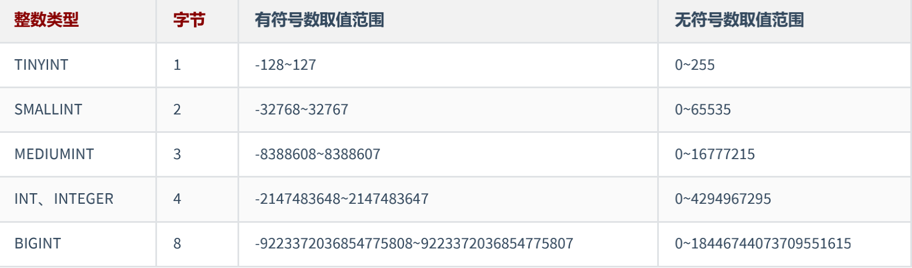
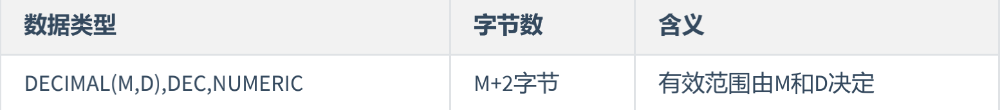
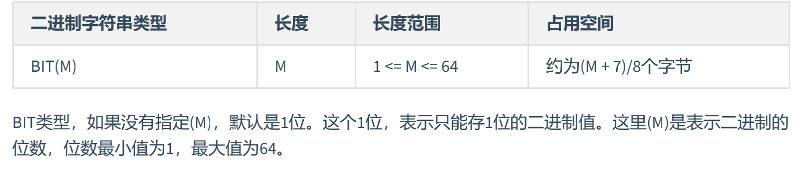
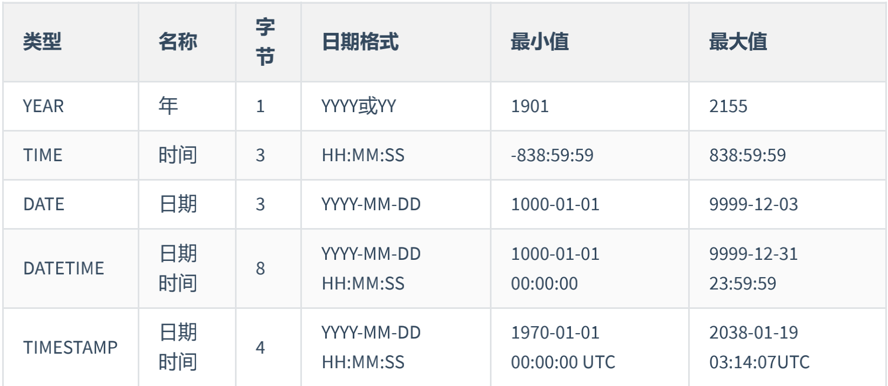
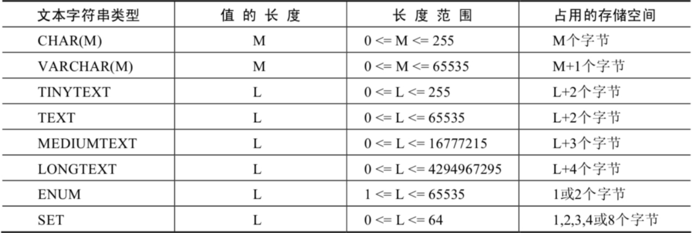
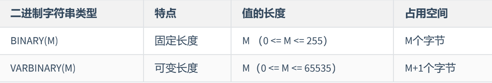
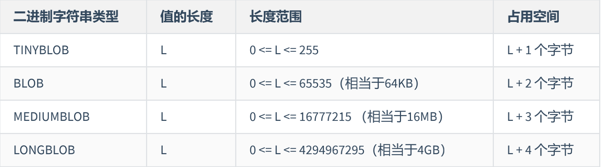

#### **整数类型**

**可选属性**
* M int(5) 只配合 ZEROFILL 做不满足长度填充0使用; 8.0中已不建议设置;默认显示宽度与其有符号数的最小值的宽度相同,无符号减1;
* UNSIGNED
* ZEROFILL 自动为当前列添加UNSIGNED属性;不够用0左边填充
#### **浮点类型 存在精度误差慎用**

无论有没有符号，MySQL 的浮点数都会存储表示符号的部分。因此， 所谓的无符号数取值范围，其实就是有符号数取值范围大于等于零的部分
UNSIGNED不会改变数据范围
1. 如果存储时，整数部分超出了范围，MySQL就会报错，不允许存这样的值
2. 如果存储时，小数点部分若超出范围，就分以下情况：
* 若四舍五入后，整数部分没有超出范围，则只警告，但能成功操作并四舍五入删除多余的小数位后保存。例如在FLOAT(5,2)列内插入999.009，近似结果是999.01。
* 若四舍五入后，整数部分超出范围，则MySQL报错，并拒绝处理。如FLOAT(5,2)列内插入999.995和-999.995都会报错
3. 从MySQL 8.0.17开始，FLOAT(M,D) 和DOUBLE(M,D)用法在官方文档中已经明确不推荐使用，将来可能被移除。另外，关于浮点型FLOAT和DOUBLE的UNSIGNED也不推荐使用了，将来也可能被移除
4. MySQL 用 4 个字节存储 FLOAT 类型数据，用 8 个字节来存储 DOUBLE 类型数据。无论哪个，都是采用二进制的方式来进行存储的。比如 9.625，用二进制来表达，就是 1001.101，或者表达成 1.001101×2^3。如果尾数不是 0 或 5（比如 9.624），你就无法用一个二进制数来精确表达。进而，就只好在取值允许的范围内进行四舍五入
#### **定点数类型**

* 定点数在MySQL内部是以 字符串 的形式进行存储，这就决定了它一定是精准的。
* 当DECIMAL类型不指定精度和标度时，其默认为DECIMAL(10,0)。当数据的精度超出了定点数类型的精度范围时，则MySQL同样会进行四舍五入处理
#### **位类型 BIT**

使用SELECT命令查询位字段时，可以用( BIN()去前面0的值 或 HEX() 或+0获取十进制数据的值 )函数进行读取
#### **日期与时间类型**

1. 00到69表示2000到2069；70到99表示1970到1999
2. TIMESTAMP和DATETIME的区别：
* TIMESTAMP存储空间比较小，表示的日期时间范围也比较小
* 底层存储方式不同，TIMESTAMP底层存储的是毫秒值，距离1970-1-1 0:0:0 0毫秒的毫秒值。
* 两个日期比较大小或日期计算时，TIMESTAMP更方便、更快。
* TIMESTAMP和时区有关。TIMESTAMP会根据用户的时区不同，显示不同的结果。而DATETIME则只能反映出插入时当地的时区，其他时区的人查看数据必然会有误差的。
#### **文本字符串类型**

1. MySQL4.0版本以下，varchar(20)：指的是20字节，如果存放UTF8汉字时，只能存6个（每个汉字3字节） ；MySQL5.0版本以上，varchar(20)：指的是20字符
2. 检索VARCHAR类型的字段数据时，会保留数据尾部的空格;CHAR类型会去掉空格
3. VARCHAR的占用空间是M+1 1是记录的长度
4. ENUM只能选择一个成员,SET可以选择多个
#### **二进制字符串类型**

