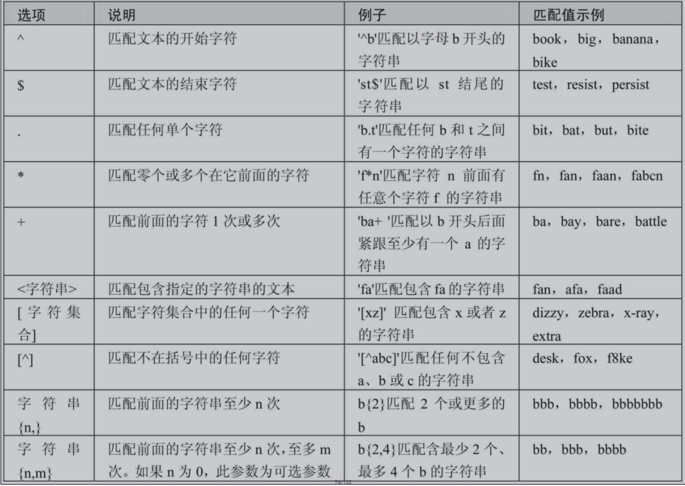
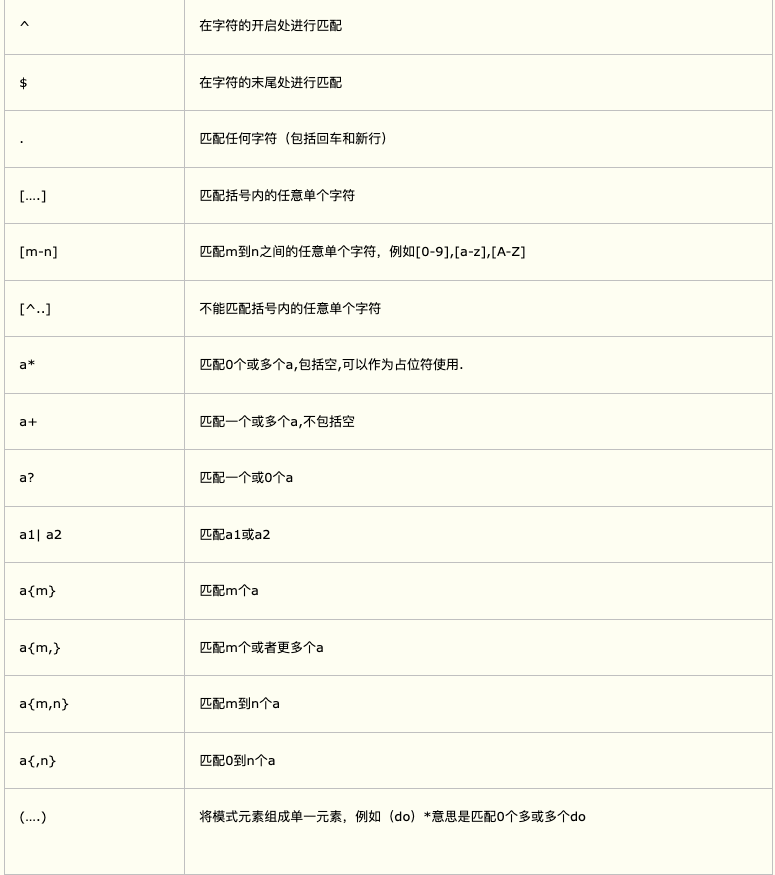

#### **算术运算符 + - * / %**
在MySQL中，一个数除以0为NULL
NULL参与计算都为NULL
```
#筛选出employee_id是偶数的员工
SELECT * FROM employees WHERE employee_id MOD 2 = 0;
```
#### **比较运算符 = <=> <> < <= > >=**
判断等号两边的值、字符串或表达式是否相等，如果相等则返回1，不相等则返回0
1. **等号运算符**
* 如果等号两边的值、字符串或表达式都为字符串，则MySQL会按照字符串进行比较，其比较的是每个字符串中字符的ANSI编码是否相等。
* 如果等号两边的值一个是整数，另一个是字符串，则MySQL会将字符串转化为数字进行比较。
* 如果等号两边的值、字符串或表达式中有一个为NULL，则比较结果为NULL。
2. **安全等于运算符**
* 可以用来对NULL进行判断。在两个操作数均为NULL时，其返回值为1，而不为NULL
* 当一个操作数为NULL时，其返回值为0，而不为NULL
3. **不等于运算符**
* 不等于运算符（<>和!=）用于判断两边的数字、字符串或者表达式的值是否不相等，如果不相等则返回1，相等则返回0
* 不等于运算符不能判断NULL值。如果两边的值有任意一个为NULL，或两边都为NULL，则结果为NULL。 SQL语句示例如下
4. **空/非空运算符**
```
SELECT employee_id,commission_pct FROM employees WHERE commission_pct IS NULL; 
SELECT employee_id,commission_pct FROM employees WHERE commission_pct <=> NULL; 
SELECT employee_id,commission_pct FROM employees WHERE ISNULL(commission_pct);

SELECT employee_id,commission_pct FROM employees WHERE commission_pct IS NOT NULL; 
SELECT employee_id,commission_pct FROM employees WHERE NOT commission_pct <=> NULL; 
SELECT employee_id,commission_pct FROM employees WHERE NOT ISNULL(commission_pct);
```
5. **最小值/最大值运算符**
* 当参数是整数或者浮点数时，LEAST将返回其中最小的值；
* 当参数为字符串时，返回字母表中顺序最靠前的字符；
* 当比较值列表中有NULL时，不能判断大小，返回值为NULL
6.  **BETWEEN AND运算符**
 C BETWEEN A AND B，此时，当C大于或等于A，并且C小于或等于B时，结果为1，否则结果为0
7. **LIKE**
“%”：匹配0个或多个字符
 “\_”：只能匹配一个字符 表示任意一个字符
转义符  LIKE 'IT\\\_%'    或者    LIKE 'IT$_%' escape '$'
8.  **REGEXP运算符**
* ‘^’匹配以该字符后面的字符开头的字符串。
* ‘$’匹配以该字符前面的字符结尾的字符串。
* ‘.’匹配任何一个单字符。
* “[...]”匹配在方括号内的任何字符。例如，“[abc]”匹配“a”或“b”或“c”。为了命名字符的范围，使用一个‘-’。“[a-z]”匹配任何字母，而“[0-9]”匹配任何数字。
* ‘\*’匹配零个或多个在它前面的字符。例如，“x*”匹配任何数量的‘x’字符，“[0-9]\*”匹配任何数量的数字，而“*”匹配任何数量的任何字符
#### **逻辑运算符 NOT/! AND/&& OR/|| XOR**
逻辑异或（XOR）运算符是当给定的值中任意一个值为NULL时，则返回NULL；
如果两个非NULL的值都是0或者都不等于0时，则返回0；如果一个值为0，另一个值不为0时，则返回1
#### **位运算符 & | ^ ~ >> <<**
* 按位与（&）运算符将给定值对应的二进制数逐位进行逻辑与运算。当给定值对应的二进制位的数值都为1时，则该位返回1，否则返回0(俩个都是1就是1否则0)
* 按位或（|）运算符将给定的值对应的二进制数逐位进行逻辑或运算。当给定值对应的二进制位的数值有一个或两个为1时，则该位返回1，否则返回0(一个为1就是1否则0)
* 按位异或（^）运算符将给定的值对应的二进制数逐位进行逻辑异或运算。当给定值对应的二进制位的数值不同时，则该位返回1，否则返回0(俩个不一致 一个是0一个是1就是1 否则是0)
* 按位取反（~）运算符将给定的值的二进制数逐位进行取反操作，即将1变为0，将0变 为1
* 按位右移（>>）运算符将给定的值的二进制数的所有位右移指定的位数。右移指定的位数后，右边低位的数值被移出并丢弃，左边高位空出的位置用0补齐
* 按位左移（<<）运算符将给定的值的二进制数的所有位左移指定的位数。左移指定的位数后，左边高位的数值被移出并丢弃，右边低位空出的位置用0补齐
#### **运算符优先级**
赋值运算符的优先级最低，使用“()”括起来的表达式的优先级最高
#### **正则扩展**


# {}有争议测试不能限制最大数...
# 回头补充怎么计算字符的二进制 0100001这种